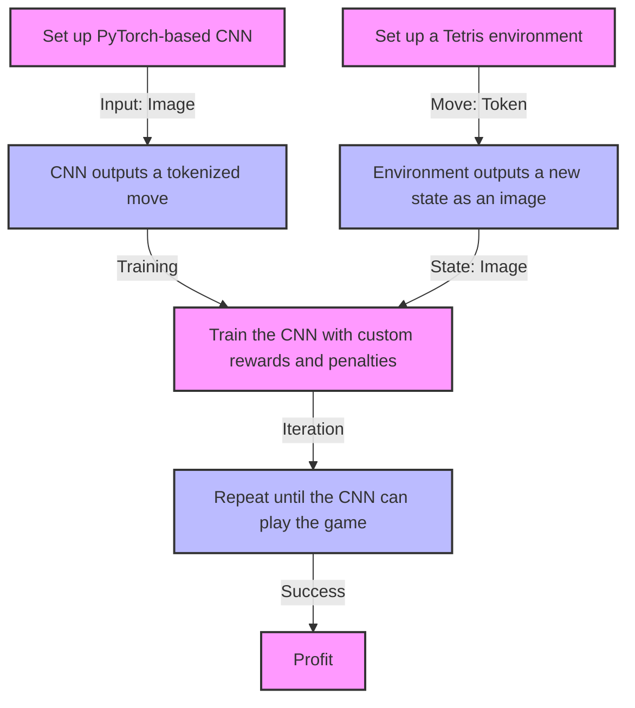

## TetrAI
An attempt to make a visual learning tetris AI

Current Plan

```mermaid
graph TD;
    A[Set up PyTorch-based CNN] -->|Input: Image| B[CNN outputs a tokenized move];
    C[Set up a Tetris environment] -->|Move: Token| D[Environment outputs a new state as an image];
    B -->|Training| E[Train the CNN with custom rewards and penalties];
    D -->|State: Image| E;
    E -->|Iteration| F[Repeat until the CNN can play the game];
    F -->|Success| G[Profit];
    
    style A fill:#f9f,stroke:#333,stroke-width:2px;
    style B fill:#bbf,stroke:#333,stroke-width:2px;
    style C fill:#f9f,stroke:#333,stroke-width:2px;
    style D fill:#bbf,stroke:#333,stroke-width:2px;
    style E fill:#f9f,stroke:#333,stroke-width:2px;
    style F fill:#bbf,stroke:#333,stroke-width:2px;
    style G fill:#f9f,stroke:#333,stroke-width:2px;
```

