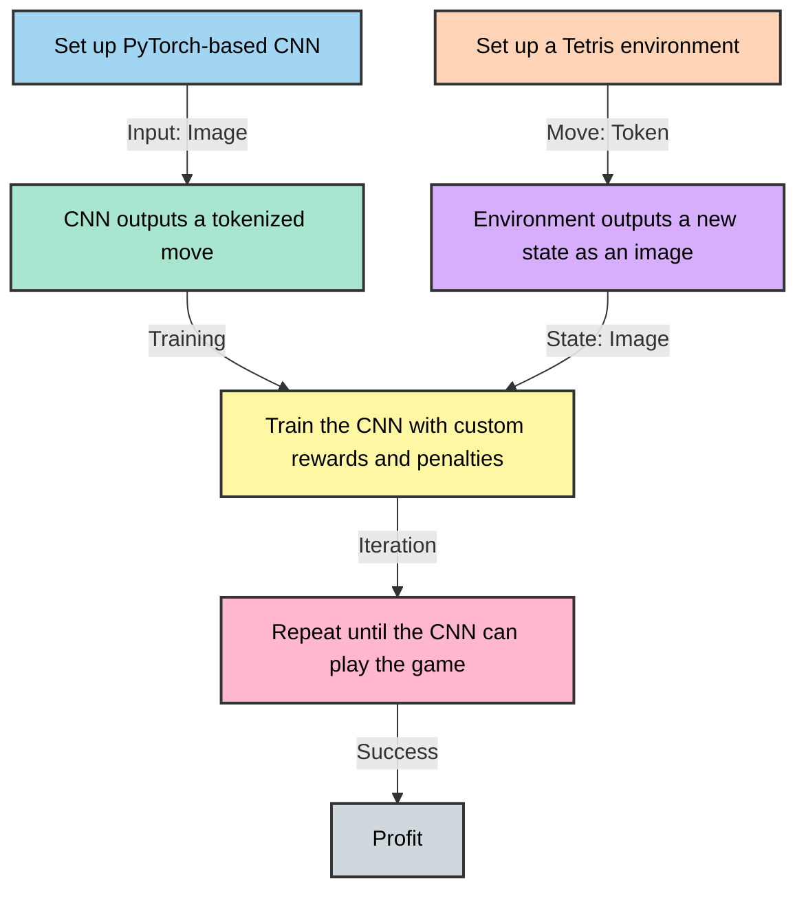

## TetrAI
An attempt to make a visual learning tetris AI

Current Plan


## Commands
```bash
python tetrai/RewardWeights.py
```
- Example run
```bash
python tetrai/DDQNonCNN.py --num_episodes 2000 --max_moves 200 --weights 'E:\CodingProjects\tetrai\tetrai\weights.json'
```
```bash
python tetrai/PPOonCNN.py --num_episodes 2000 --max_moves 200 --weights 'E:\CodingProjects\tetrai\tetrai\weights.json'
```

- Prev run
```bash
python tetrai/DDQNonCNN.py --num_episodes 10000 --max_moves 40 --weights 'E:\CodingProjects\tetrai\tetrai\reward_only.json' --save_interval 250 --cycles 16 --learning_rate .0001 --resume True --policy_net 'E:\CodingProjects\tetrai\out\1734167643\tetris_policy_net_500.pth' --target_net 'E:\CodingProjects\tetrai\out\1734167643\tetris_target_net_500.pth' --level_inc 3000
```